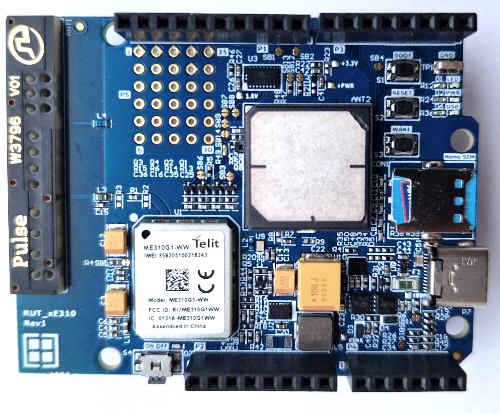

# ME310G1-WW Arduino Shield Prototype

This is the Arduino Shield for the Telit LPWA modem ME310G1-WW with a 2G fallback. The project was designed to have compatibility with all the xE310 series modems.

## Features

-   Telit ME310G1-WW LPWA modem with a 2G fallback.
-   Compatibility with ME310G1 Series and NE310H2, NE310L2 modems.
-   GNSS [Yegeo ANT1818B00BT1516S] and LPWA [Pulse W3796] antennas onboard.
-   NJG1157PCD-TE1 GPS and GLONASS front-end module from NJR.
-   JAE USB Type-C connector and USB-PD stand-alone controller STUSB4500BJR.
-  AP63357DV-7 - 3.8V TO 32VINPUT, 3.5A Low IQ synchronous Buck Converter with Enhanced EMI Reduction.
-  PI4ULS5V108 - 8-Bit Bi-direction Level Shifter for modem interface with the host.

## Legal Disclaimer

The evaluation board including the software is for testing purposes only and, because it has limited functions and limited resilience, is not suitable for permanent use under real conditions. If the evaluation board is nevertheless used under real conditions, this is done at one’s responsibility; any liability of Rutronik is insofar excluded. 

